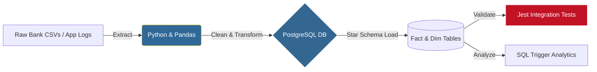

# DTE Solutions | High-Fidelity Behavioral Tech Hub

**Pure Data Integrity. Behavioral Intelligence. Engineering Performance.**

This repository serves as the **Corporate Hub** for DTE Solutions LLC, accessible live at [dte-solutions.icu](https://dte-solutions.icu). 

We engineer the digital trust layer between human behavior and financial growth, specializing in high-fidelity analytical ecosystems for the $84 Trillion Great Wealth Transfer.

---

## ⚡ The Big Three (Focus Products)

### 🦅 NestLegacy | Wealth Transfer Engine
*The Digital Trust Layer for Inheritors.*
AI-driven lead intelligence that bridges the gap between complex inheritance scenarios and fiduciary experts. Pre-qualifies leads behaviorally and financially to ensure maximum advisory ROI.
[Launch Nexus](https://dte-84.github.io/NestLegacy/)

### 💓 Pulse | Financial Behavior AI
*Your Financial Mirror.*
A high-fidelity behavioral intelligence system detecting spending rhythms and emotional triggers. Powered by the **Financial User Behavior Pipeline (Python/Pandas/Postgres)** to provide truth-forward coaching and impulse trigger analytics.
[Open Pulse](https://dte-84.github.io/Pulse/)

---

## 🏗️ Financial User Behavior Pipeline: Tracking Impulse Triggers
### From Raw Bank Logs to Impulse Spending Metrics using Python, PostgreSQL, and Jest

*Architecture Decisions:*
- **Python (Pandas)**: Superior data-wrangling for messy bank logs.
- **Postgres (Star Schema)**: Optimized for rapid behavioral slicing by mood and time.
- **Jest (Validation)**: Mathematically accurate, production-ready reliability.

### ⛳ Fluff | Biomechanic Analyst
*Elite PGA-Grade Swing Suite.*
Real-time kinetic chain tracking using computer vision biometrics. Synchronized leaderboards and AI-certified coaching drills for competitive athletes.
[Launch Lab](https://dte-84.github.io/Fluff/)

---

## 🧪 Technical Laboratory (Extended Ecosystem)

* **JDC TSoST:** High-fidelity e-portfolio architecture for technical skill verification.
* **SiKnight:** Real-time gaming hub with dynamic state management.
* **Nova Nexus:** Immersive AI interaction environment shell.
* **PCSP MCSDD:** HIPAA-compliant clinical documentation case study for Missouri state agencies.
* **Inventory:** Retail management engine with Winsorized data tracking.
* **E-Library:** Modular e-commerce bookstore architecture.

---

## 🏛️ Founder Annex
For a deep dive into the technical foundation, mentorship history, and full-stack philosophy of our Principal Engineer, visit the [Founder Annex](https://dte-84.github.io/DTE-E-Portfolio/).

---

## ⚙️ Technical Philosophy
* **Winsorized Integrity:** We eliminate data noise at the source.
* **Behavioral UX:** Interfaces designed around how humans actually make decisions.
* **Compliance-First:** Audit-ready architecture built into the DNA of every system.

**© 2026 DTE Solutions // Behavioral Intelligence Division**
